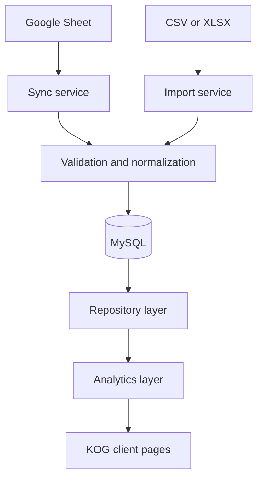

# Architecture

## Boundaries

- `app/`: client-facing presentation, navigation, filters, responsive tables, charts, loading, empty, and error states.
- `server/api/`: authenticated HTTP boundary. Every business-data endpoint resolves the signed-in client scope server-side.
- `server/repositories/`: database queries and source-independent read models.
- `server/services/`: imports, Google Sheets synchronization, validation, normalization, and upserts.
- `server/domain/`: deterministic analytics, campaign normalization, row hashing, and deduplication.
- `server/db/`: Drizzle schema and MySQL connection.
- `migrations/`: versioned schema changes.

## Data flow

The UI never imports Google, CSV, XLSX, or MySQL-specific code. A future Meta adapter or CRM database can write to the same normalized tables.

## Future CRM compatibility

Tenant-owned tables carry `client_id`. Users connect to clients through `user_clients`. Roles exist at account and client membership level. This supports a future TCZ Owner role, multiple clients, multiple users, and granular authorization without changing client pages.

Campaign matching prefers a source campaign ID. A normalized campaign name is the fallback. Future Meta campaign IDs fit the existing `source_campaign_id` field.

## Authentication

Production sessions use random opaque tokens. Only the SHA-256 token hash is stored in MySQL. Cookies are HTTP-only, secure in production, same-site, host-scoped, and expire after eight hours. Passwords use bcrypt with a cost of 12 in the seed path.

Demo authentication uses a signed eight-hour token and is rejected when `NODE_ENV=production`.

## Scheduling

`POST /api/sync/google-sheet` accepts an authenticated user for Sync Now or a Bearer `SYNC_SECRET` for a scheduler. MySQL `GET_LOCK` prevents overlapping client syncs. The 30-minute schedule is deployment configuration, not a browser timer.
